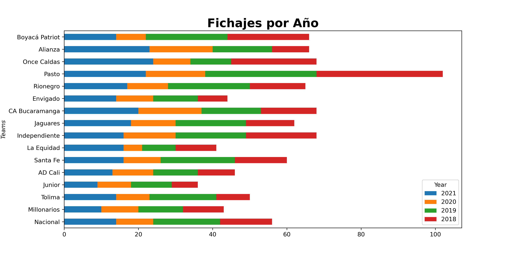

**Algoritmos Predictivos para el Éxito de Fichajes**
================
## **Web Scraping de Datos**

Para la recopilación de Datos decidimos hacer scraping de los datos de la Liga Betplay del 2017 hasta el 2021. Para lo anterior, filtramos la información de la siguiente manera:

1. Por medio del url de la liga recopilamos los equipos que jugaron cada temporada
2. Filtramos los equipos que descendieron en algún momento, ya que no existen estadísticas de la Liga B en Colombia
3. Posteriormente, obtenemos todos los jugadores que se desempeñaron en el equipo desde el 2016 al 2021. Lo anterior, para obtener aquellos jugadores en el equipo que no se encontraban en un año anterior, es decir los fichajes. 
4. Finalmente, obtenemos los links de los fichajes para obtener las estadísticas de los jugadores (necesarias para entrenar el modelo)  

<figure>
<figcaption aria-hidden="true">Número de Fichajes por Año</figcaption>
</figure>

